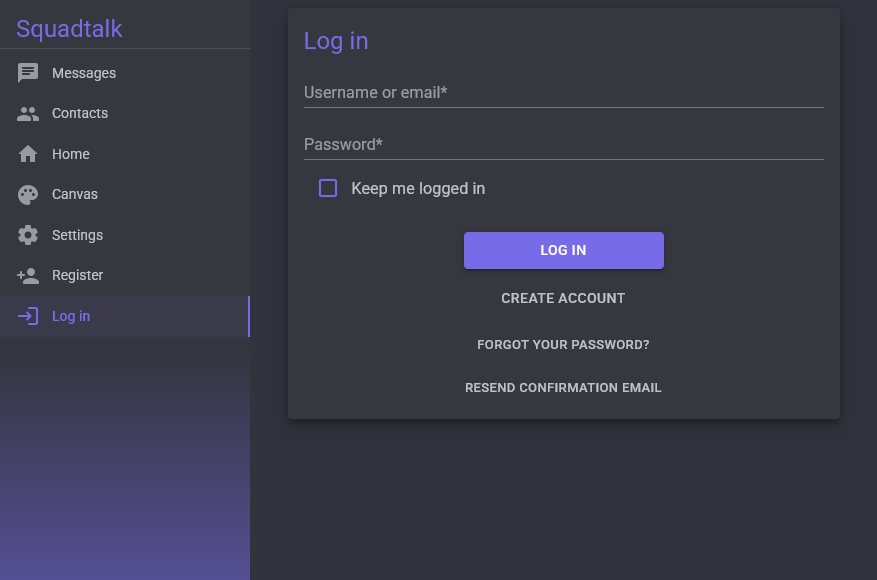
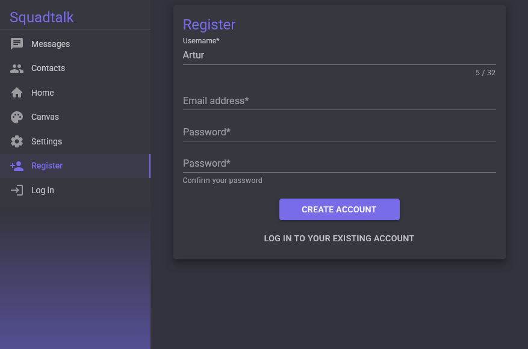
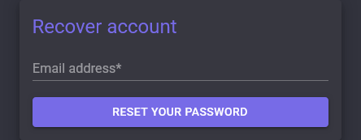
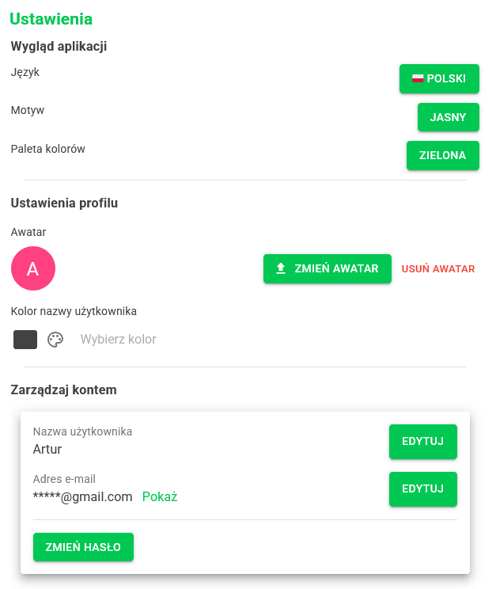
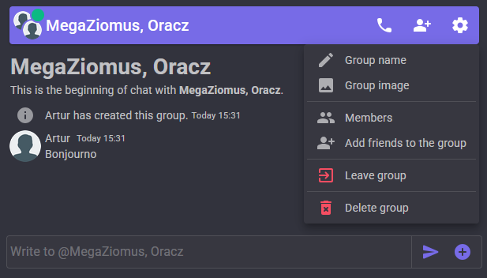

# Squadtalk

Squadtalk is a web-based application designed for seamless chatting, file sharing, and voice/video calls with your friends. It's built to enhance real-time communication with a modern, user-friendly interface and support for a variety of features.

## Key Features

### Account Management

- **Sign Up & Login** – Real-time user input validation for a smooth sign-up and login experience.
- **Profile Management** – Edit your username, email, and password at any time.
- **Email Verification** – Required for registration and any email-related changes.

  Screenshots:
  - 
  - 
  - 
  - 
  - 

### Localization & Personalization

- **Languages Supported**: English and Polish UI languages.
- **Localization**: Utilizes the [TextLocalizer](https://www.nuget.org/packages/TextLocalizer) package to manage translations.
- **Theme Customization**: Users can personalize the app's color palette and theme.

  

### Friends & Messaging

- **Friend List**: Users can send and accept friend requests.
- **Private & Group Chats**:
  - Direct messages with friends.
  - Group chats with a **4-level permission system** for managing roles and access.

  Screenshots:
  - 
  - 
  - 
  - 
  - 
  - 
  - 

### File Sharing

- **File Transfers**: Attach files to messages or share **download links**. (Account not required for downloads)
- **Unlimited File Size**: Powered by the [tus](https://tus.io/) protocol for large file uploads.
- 🚧 *File transfer functionality is currently being rewritten.*

### Real-Time Updates

- **Live Updates**: Stay updated on friend status, invitations, and chat creation with **SignalR**.

### Voice & Video Calls

- **Seamless Communication**: High-quality voice and video calls powered by **LiveKit JS SDK**.
- 🚧 *Call functionality is currently being rewritten.*

### Prerendering Support

- **Server-Side Rendering**: Most components and subpages are designed for proper display during server-side prerendering.

### UI library
- **[MudBlazor](https://mudblazor.com/)**

---

## Backend & Deployment

### Technology Stack

- **Backend**: ASP.NET Core, EF Core, Identity Core, SignalR
- **Databases**: PostgreSQL, Redis
- **Background Jobs**: Quartz (for scheduled tasks like emails and image previews)
- **WebRTC Server**: LiveKit SFU

### Hosting & Deployment

- **Hosting**: Deployed on a remote physical machine behind a [YARP](https://dotnet.github.io/yarp/index.html) proxy.
- **Domain Management**: Uses custom DDNS with Cloudflare for domain management.
